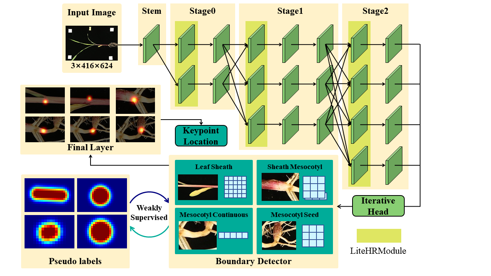
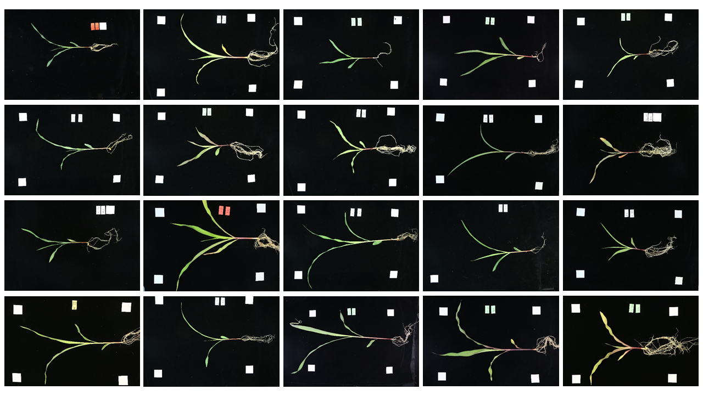
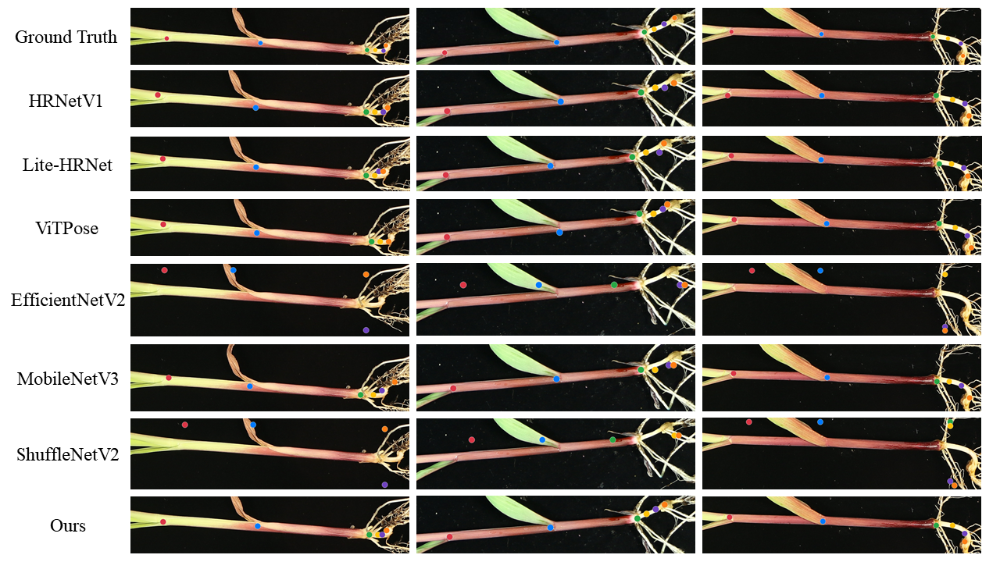

# MaizeBKN
**A Weakly-Supervised Boundary-Aware Keypoint Network for Precise Phenotyping of Maize Seedlings**

## 📖 Introduction

This repository contains the official implementation and dataset for the paper **"MaizeBKN: A Weakly-Supervised Boundary-Aware Keypoint Network for Precise Phenotyping of Maize Seedlings"**.

**MaizeBKN** is a lightweight yet powerful keypoint detection network designed for agricultural edge devices. It achieves state-of-the-art accuracy with minimal computational cost.

### ✨ Key Features
- **🚀 Ultra-Lightweight:** Only **0.70M** parameters (38% lower than Lite-HRNet) and **1.13 GFLOPs**.
- **🎯 High Precision:** Achieves **98.89% AP** and **99.60% AR** on the MaizeSeedling-Calib dataset.
- **📏 Boundary-Aware:** Introduces a weakly-supervised boundary mining mechanism to handle blurry boundaries and tiny organs.
- **🌽 Phenotyping System:** Includes a pipeline for extracting phenotypic traits like leaf sheath length and mesocotyl length.
---

## 📂 MaizeSeeding-Calib

We provide the **MaizeSeedling-Calib** dataset, a millimeter-calibrated dataset for maize seedling phenotyping.

 **⚠️Note:** Due to the ongoing nature of the research project, we are currently releasing a **subset** of the dataset for benchmarking and testing purposes. The full dataset will be made publicly available upon the completion of the project.

## 📊 Model Zoo & Results
###  Results of comparative experiments
| Model | Params (M)  | GFLOPs  | AP (%)  | AR (%)  | Score  | PCK@0.05  | PCK@0.1  | NME  |
| :--- | :---: | :---: | :---: | :---: | :---: | :---: | :---: | :---: |
| HRNetV1 | 28.54 | 40.89 | 98.53 | 99.25 | 86.03 | 87.92 | 96.18 | 3.78 |
| Lite-HRNet | 1.13 | 1.19 | 98.67 | 99.41 | 82.78 | 83.15 | 95.34 | 3.67 |
| ViTPose | 89.84 | 116.62 | 97.81 | 98.77 | 87.14 | 86.42 | 95.92 | 3.84 |
| EfficientNetV2-S | 20.77 | 15.31 | 84.27 | 86.87 | 33.87 | 9.62 | 36.27 | 15.44 |
| MobileNetV3 | 2.90 | 24.47 | 98.46 | 99.23 | 84.75 | 80.47 | 94.35 | 4.15 |
| ShuffleNetV2-x1.0 | 1.52 | 0.86 | 87.44 | 89.38 | 37.70 | 9.40 | 38.33 | 14.07 |
| **MaizeBKN (Ours)** | **0.70** | **1.13** | **98.89** | **99.60** | **87.15** | **99.12** | **99.67** | **0.76** |

## 🖼️ Visualization
###  Visual comparison of keypoint detection performance across different models

