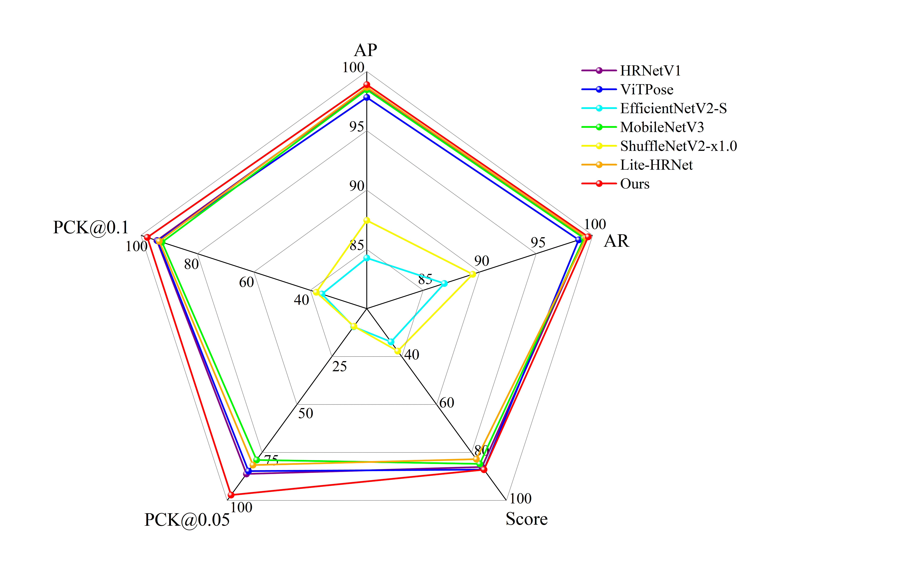

# MaizeBKN

## 📖 Introduction

**MaizeBKN** is a specialized keypoint detection model designed to overcome the inefficiency and subjectivity of traditional manual measurements in maize breeding. It focuses on the rapid and precise extraction of critical agronomic traits—specifically **leaf sheath** and **mesocotyl length**—which are vital indicators for high-density planting potential and lodging resistance.

Built upon a streamlined **Lite-HRNet** backbone, MaizeBKN achieves a superior balance between lightweight deployment and feature representation through channel pruning and module reorganization. Crucially, it introduces an innovative **boundary feature enhancement mechanism** guided by **pseudo-label weak supervision** and **morphological priors**. This allows the network to adaptively strengthen feature responses at the subtle structural connections of seedlings, ensuring high robustness even in complex environments.

### ✨ Key Features

- **🚀 Ultra-Lightweight Design:** By implementing channel pruning alongside structural reorganization, our model successfully cuts down the parameter count by **38.1%** and lowers computational overhead by **5%** against the baseline. This streamlined design is perfectly tailored for high-throughput phenotyping pipelines.
- **🎯 State-of-the-Art Precision:** Achieves an Average Precision (**AP**) of **98.89%** and an average confidence score of **87.15%** on the standardized **MaizeSeedling-Calib** dataset.
- **📏 High-Resolution Phenotyping:** The average measurement error for phenotypic parameters is **less than 2 mm**, providing millimetric accuracy that rivals or surpasses manual measurement.
- **🔍 Weakly-Supervised Boundary Awareness:** Novel integration of a boundary detector with **pseudo-labels**, allowing the model to focus on hard-to-distinguish organ boundaries without requiring pixel-level semantic segmentation labels.
- **🧬 Practical Breeding Value:** Tested under practical conditions, our pipeline accurately measures low-light-induced **shade avoidance traits**. This demonstrates its strong potential as a reliable tool for identifying high-density tolerant maize varieties during germplasm selection.
---

## 📂 MaizeSeeding-Calib

We provide the **MaizeSeedling-Calib** dataset, a millimeter-calibrated dataset for maize seedling phenotyping.

 

## 📊 Model Zoo & Results
###  Results of comparative experiments

## 🖼️ Visualization
###  Visual demonstration of detection accuracy and robustness among the compared methods

## ⚠️ Note
#### As the project is still in progress, this repository currently contains a portion of the dataset. The complete dataset will be released after the project concludes.

